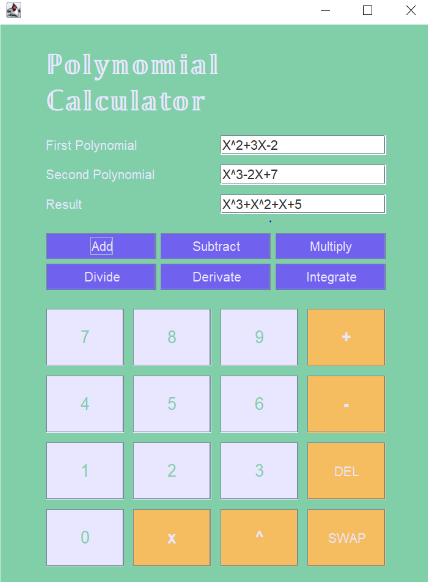

# 🧮 Polynomial Calculator - Java Project

A **Polynomial Calculator** implemented in **Java** with a user-friendly graphical interface using **Java Swing**. Perform various polynomial operations effortlessly! 🚀

---

## 📜 Features
- **➕ Addition**: Add two polynomials.
- **➖ Subtraction**: Subtract one polynomial from another.
- **✖️ Multiplication**: Multiply two polynomials.
- **➗ Division**: Divide two polynomials and get both the quotient and remainder.
- **📈 Derivation**: Compute the derivative of a polynomial.
- **📉 Integration**: Integrate a polynomial.

---

## 🖥️ GUI Overview
The graphical interface includes:
- **Input Fields**: Enter polynomials.
- **Operation Buttons**: Perform addition, subtraction, multiplication, division, derivation, and integration.
- **Numeric Buttons**: Easily input coefficients and exponents.
- **Result Display**: View results clearly.
---
## ✅ JUnit Testing
To ensure the correctness and reliability of the polynomial operations, the project includes comprehensive **JUnit tests**. These tests cover:
- **Addition**: Verifies the sum of two polynomials.
- **Subtraction**: Checks the difference between two polynomials.
- **Multiplication**: Tests the product of two polynomials.
- **Division**: Confirms the accuracy of quotient and remainder.
- **Derivation**: Validates the derivative computation of a polynomial.
- **Integration**: Ensures correct integration of polynomials.

### Running the Tests
1. Open the project in your preferred IDE (e.g., **IntelliJ IDEA** or **Eclipse**).
2. Navigate to the `/test` directory.
3. Run the JUnit test suite to execute all test cases:
   - In IntelliJ IDEA: Right-click the `test` folder and select **Run All Tests**.
   - In Eclipse: Right-click the `test` package and choose **Run As > JUnit Test**.

By using JUnit, the project ensures robust functionality and maintains a high level of reliability across all polynomial operations. ✅

---
## 📷 Screenshot
Here’s a snapshot of the application in action:  



---

## 🚀 Steps to Run
1. **Clone the Repository**:
   ```bash
   git clone https://github.com/ralucaand03/Polynomial_Calculator---ProgramingTehniques-Java.git
2. Open the Project:
    Use an IDE like IntelliJ IDEA or Eclipse.
3. Run the Application:
    Run the Main class to launch the GUI.
Enjoy!:
Input polynomials, select operations, and view results.
